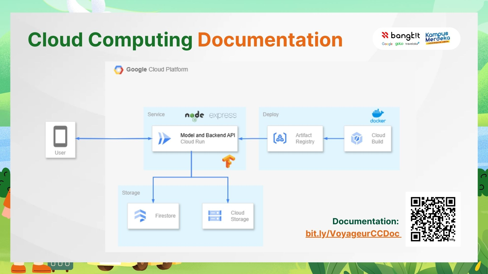

# Voyageur

## 🚀 Capstone Project: Simplifying Group Trip Planning

Voyageur is a mobile application designed to streamline the process of group trip planning. By integrating advanced cloud computing solutions, the app offers real-time collaboration, robust backend infrastructure, and secure data management for a seamless user experience.

---

## 🌐 Cloud Computing Overview

### 🔧 Technologies Used:
1. **Google Cloud Platform (GCP)**:
   - **Cloud Run**: For deploying serverless backend services.
   - **Cloud Storage**: For storing trip-related data like itineraries, user profiles, and multimedia files.
   - **Firestore (NoSQL Database)**: To handle real-time database operations and synchronization across devices.
   - **API Gateway**: For secure communication between the mobile app and backend services.
   - **Cloud Functions**: For executing event-driven workflows, such as notifications and expense calculations.

2. **Third-party APIs**:
   - **Google Maps API**: For integrating location services, route planning, and trip visualization.
   - **Tourist Destination API**: To fetch popular destinations and activities dynamically.

### 💡 Cloud Architecture
- **Frontend**: Mobile app built in Kotlin (native Android).
- **Backend**: Deployed as serverless microservices on Cloud Run, interfacing with Firestore for real-time data operations.
- **Data Management**: Cloud Storage for media uploads and Firestore for trip data.
- **CI/CD**: Integrated pipelines using Cloud Build for automated deployments.

---

## 🛠 Features Powered by Cloud Computing

### ✅ **Real-Time Collaboration**
- Firestore's real-time sync allows group members to view and edit trip plans simultaneously without conflicts.

### ✅ **Voting and Polls**
- Cloud Functions ensure automated counting and validation of votes for destinations and activities.

### ✅ **Expense Management**
- Secure calculations and history storage handled via Firestore and event-driven Cloud Functions.

### ✅ **Personalized Recommendations**
- Integrated machine learning models deployed on GCP recommend activities and destinations based on user preferences.

---

## 📈 Benefits of Using GCP

- **Scalability**: Serverless architecture adapts to increasing user demands.
- **Cost-Effectiveness**: Pay-per-use model reduces unnecessary infrastructure costs.
- **Security**: Built-in GCP services ensure secure data transmission and storage.
- **Speed**: Cloud-native tools enable faster development and deployment cycles.

---
